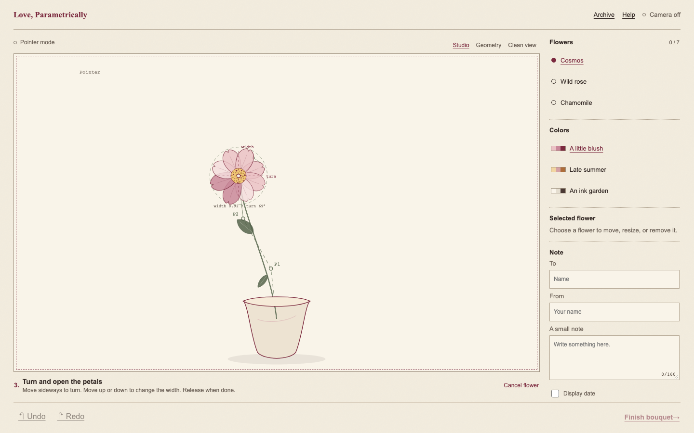

# Love, Parametrically

Hello! This is a small valentine's day project for me :) I coded it a couple years ago, and am now uploading to my gihub! Youcan draw each stem, shape its petals, and send the finished bouquet as a file.

Every flower keeps its curve, seed, petal width, turn, and size as numbers. A saved recipe grows the same bouquet again. Everything runs on your device.

Use it online at [hares1234.github.io/love-parametrically](https://hares1234.github.io/love-parametrically/).

## A quick start

Use Node.js 24 or newer.

```bash
npm ci
npm run dev
```

Open [http://127.0.0.1:5173/](http://127.0.0.1:5173/). Vite will print a different address if that port is busy.

Choose **Use my mouse** for the quickest tour. Camera mode will ask for permission first.

## Included

- Cosmos, wild rose, and chamomile drawings
- Hand, mouse, touch, and keyboard controls
- A second gesture for petal width and bloom turn
- Flower moving, resizing, ordering, and removal
- Undo and redo
- A local bouquet archive
- PNG and SVG exports
- Small `.bouquet.json` gift files
- A camera-free view for recipients



## Useful commands

| Command | Purpose |
| --- | --- |
| `npm run assets:verify` | Check every bundled runtime asset. |
| `npm run typecheck` | Check the TypeScript source. |
| `npm run test` | Run the unit tests. |
| `npm run test:e2e` | Run the Chromium browser tests. |
| `npm run build` | Build the production site. |
| `npm run release` | Make the offline ZIP. |

The camera and geometry lab lives at [http://127.0.0.1:5173/?diagnostic=phase0](http://127.0.0.1:5173/?diagnostic=phase0).

## Offline version

Run this command:

```bash
npm run release
```

It creates `love-parametrically-v1.0.0.zip`. Unzip it before running the local server.

On macOS or Linux:

```bash
node server.mjs
```

On Windows PowerShell:

```powershell
node .\server.mjs
```

Then open [http://127.0.0.1:4173/](http://127.0.0.1:4173/). Keep the terminal open while the site is running.

## Bouquet files

A `.bouquet.json` file stores the curves, flower seeds, petal width, bloom turn, colors, and dedication. It contains no camera frames or hand tracking data.

Use PNG for a dependable visual copy. SVG keeps the exact flower geometry. Some SVG viewers may use a different text font.

Drafts and finished bouquets are also saved in browser storage. Browser storage can be cleared, so export favorite bouquets as files.

## Camera notes

Hand controls use a bundled MediaPipe model. Pinch once to draw a stem. Pinch the flower again to shape it. The model, WebAssembly files, worker, fonts, and texture are all local.

The browser tests use a synthetic camera. They cover permission recovery and local model loading. Real hands and real webcams still need device testing.

## Project map

- [IMPLEMENTATION_STATUS.md](IMPLEMENTATION_STATUS.md) lists completed work and test results.
- [ARCHITECTURE.md](ARCHITECTURE.md) describes the main modules.
- [START_HERE.md](START_HERE.md) ships with the offline version.
- [assets-manifest.json](assets-manifest.json) records bundled assets and checksums.
- [THIRD_PARTY_NOTICES.md](THIRD_PARTY_NOTICES.md) contains license and attribution notes.

There are no accounts or remote services. The app sends no analytics or runtime requests outside your device.
